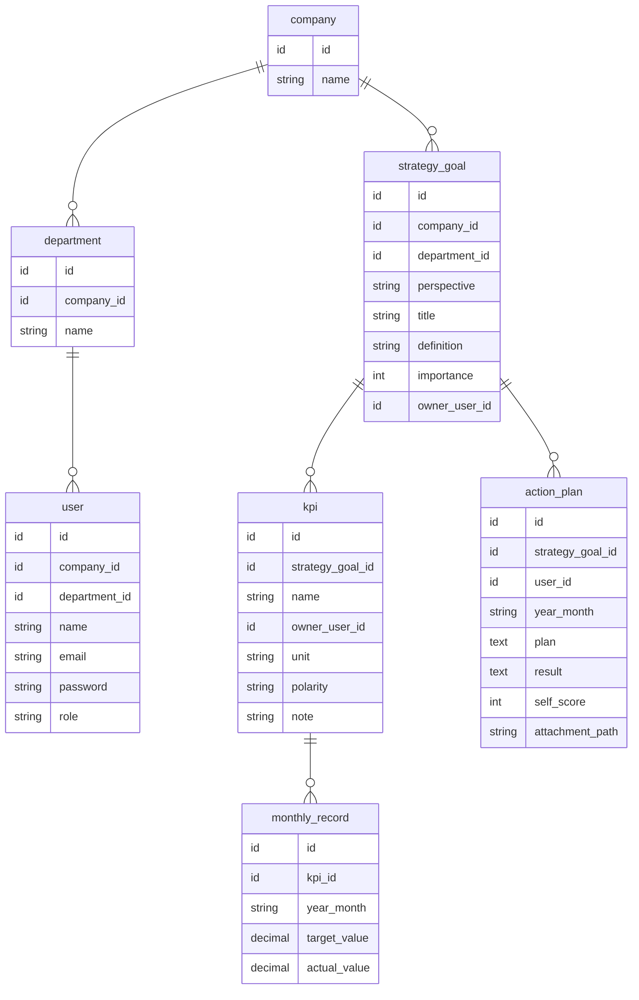

# Nami ER図

BSC型KPI管理アプリ Nami のデータベース設計。

## 全体構造

## 設計判断メモ

- **company**: 最小構成（id/name）。将来のマルチテナントSaaS化を見据えた境界線。住所・業種などは今使わないため保留（YAGNI）
- **user**: `role` / `company_id` / `department_id` を先行予約。v1はAdmin一律運用、権限制御は後続バージョンで追加
- **strategy_goal**: BSCの4視点（財務/顧客/業務プロセス/学習と成長）を `perspective` に固定値で持つ
- **kpi**: `polarity`（positive/negative）で達成判定の向きを自動化。売上=positive、コスト=negativeのように指標ごとに向きが逆
- **monthly_record**: 月次粒度で固定。週次など別粒度が必要になった場合は別テーブルとして追加する方針（既存構造を壊さない）
- **action_plan**: `self_score` は信号機3色評価。`attachment_path` は当面ローカル保存、将来的にS3へ移行想定

## 更新履歴

- 2026-07-08: 初版作成（Phase 0b）
