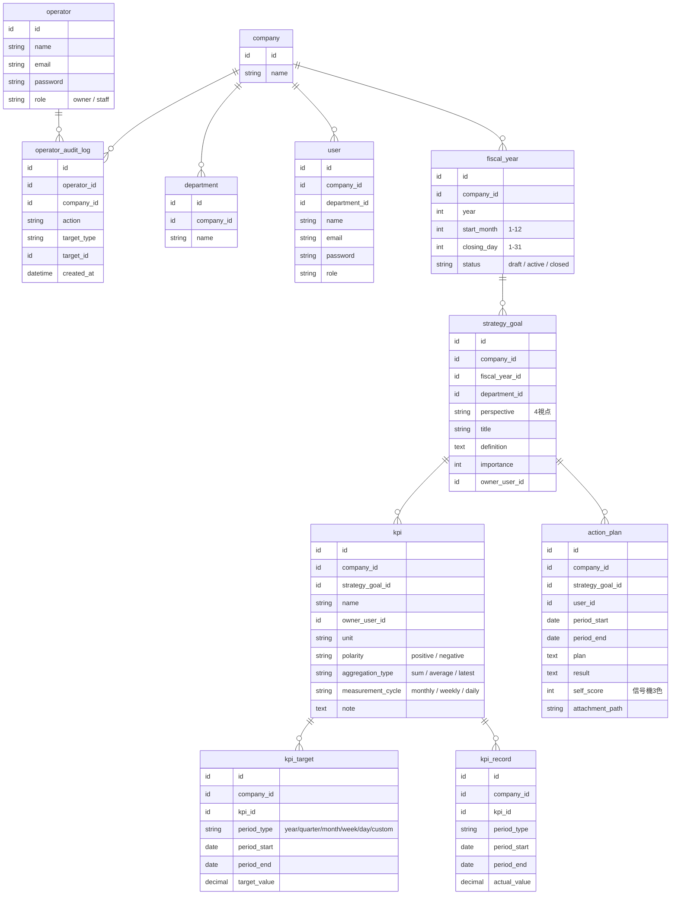

# Nami ER図

BSC型KPI管理アプリ Nami のデータベース設計。

## 全体構造

## 設計判断メモ

### マルチテナント分離
- **全テナントテーブルに `company_id` を直接持たせる**（意図的な非正規化）。JOIN経由で辿らせると Global Scope の適用漏れが越境事故に直結するため
- `company_id` は常に NOT NULL。nullable にしない
- 全モデルに Global Scope を例外なく適用する

### 運営者（和青マネジメント）
- `operator` テーブルを `user` と完全分離。認証ガードもルートも分ける
- `role`: `owner`（監査ログ閲覧可）/ `staff`（閲覧・書き込み可、監査ログ不可）
- 運営者も「1社を選んで入る」方式。セッションの `active_company_id` に対し顧客と同じ Global Scope が適用される。越境クエリは顧客企業一覧の1箇所のみ
- 画面に「運営者モード：○○社を閲覧中」を常時表示
- 運営者の書き込みは `operator_audit_log` に全件記録。ドメイン上の担当者（`owner_user_id` / `user_id`）は常に顧客企業の実在ユーザーを指す

### 年度（fiscal_year）
- 会社ごとに会計年度の開始月が異なるため独立テーブル化
- `start_month` + `closing_day` から期間を自動生成（例：4月開始・20日締め → 3/21〜4/20 が第1期間）
- 生成後の個別期間は手動編集も可能
- `status` で締め済み年度の編集を制御

### 期間の持ち方（kpi_target / kpi_record）
- `period_start` / `period_end` の**日付範囲**で保持。`year_month` のような固定単位を使わない
- 月またぎの締め日（20日締め等）、年度をまたぐ週、カスタム期間すべて表現可能
- MVPの実装は `period_type = month` のみ。日次・週次・四半期は行を足すだけで対応でき、スキーマ変更もデータ移行も不要
- 同一KPI・同一 period_type 内で期間の重複・欠落がないことをバリデーションで担保

### KPI
- `polarity`: 売上=positive（上昇が good）、コスト=negative（下降が good）。達成判定の向きを自動化
- `aggregation_type`: 累計型（売上）は sum、実測型（顧客満足度）は average / latest。年間実績の集計方法が異なるため必須
- 年間目標は月次へ均等按分するボタンを用意。月ごとの手動調整も可

### 認証
- Laravel標準（Breeze / Fortify）を採用。Cognitoは商用化後に載せ替えを検討
- 顧客と運営者はマルチ認証ガードで二系統に分離

### MVP スコープ外（構造だけ用意）
- ゲーミフィケーション、戦略マップGUI、ロール制御（v1はAdmin一律）
- 日次・週次の入力UI

## 更新履歴

- 2026-07-08: 初版作成（Phase 0b）
- 2026-08-11: 商用化を見据えた全面改訂。operator / fiscal_year /